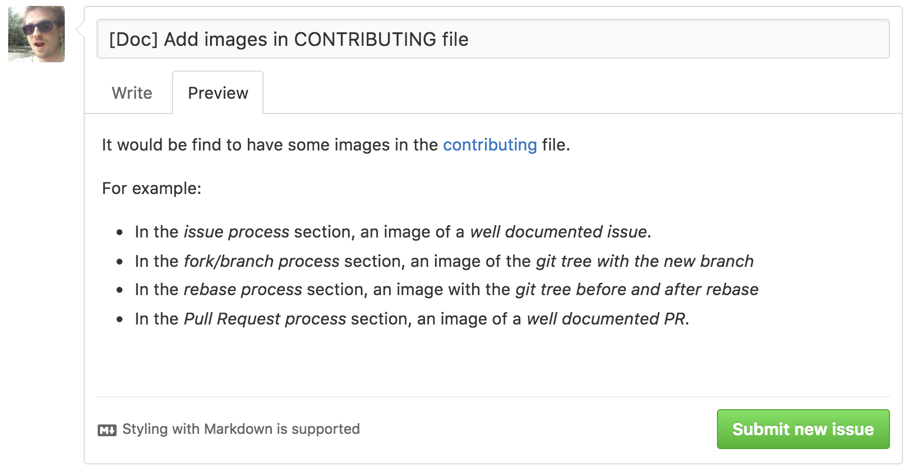
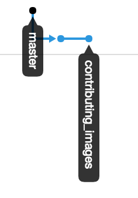
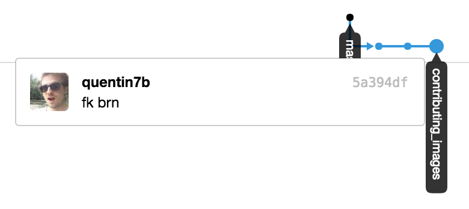
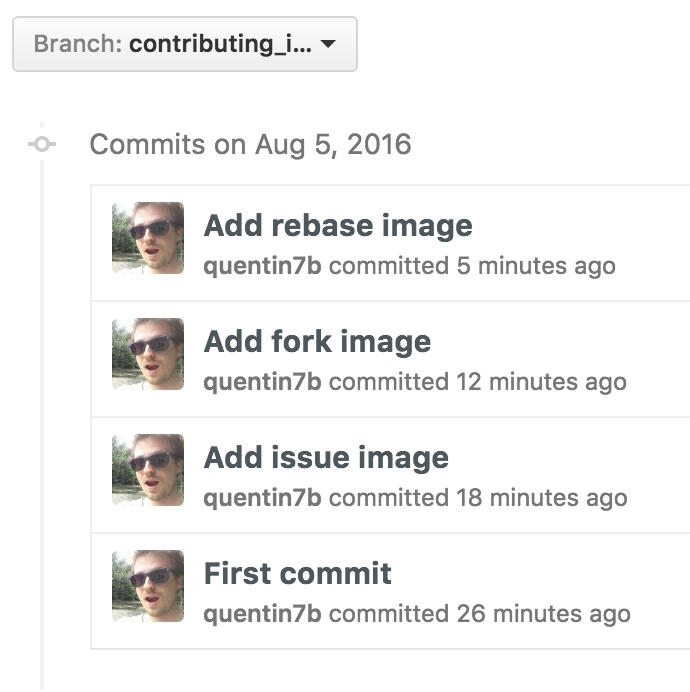
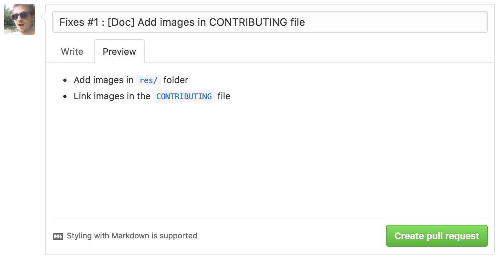

# Contributing

When contributing to this repository, please: 

1. **Discuss** the change you wish to make via an **issue** with the owners of this repository **before making a change**.
2. [**Fork**](https://help.github.com/articles/fork-a-repo/) the repository _(if not already done)_
3. Do the work in a specific branch of your repository
4. Once the work is done, please [rebase your work](https://git-scm.com/docs/git-rebase) onto the last version of **master of the _original_ repository**
5. Do a pull request and wait for the owners of this repository to accept it and merge it.

## Issue process

First of all, [fill an issue]().

The issue **must** follow this guidelines:

|Field|Guidelines|
|---|---|
|name|Pattern should be like `[Group] Issue title`*|
|description|Content should be as **complete as possible** !\*\*|

\* The _group_ can be one of these items : `Doc`, `Example`, `Code`

_For example: `[Doc] Typo in Readme` or `[Code] Trip parser fails in some cases`_ 

\** Feel free to add pieces of `code` or [links]() to the problematic file. Even screenshots if you think it could be useful.

## Fork/Branch process

> If you want to fix the issue by yourself, please tell us in the issue

Once accepted, if you didn't already fork the repository, please do it.

1. Rebase **your master** branch to the last state of the _original_ repository **master**  branch
2. Create a branch from this one. 
3. [Do it !](http://i.giphy.com/87xihBthJ1DkA.gif)

## Rebase process

When you were making changes, it's possible that someone did some changes.
Changes already merged in master.

It's also possible that you made 42 commits where it might need 5. (Are commits like `foo`, `boooh` or `tada` important ?)

So the idea is to [rebase your work on the master branch](https://git-scm.com/docs/git-rebase) so you can:

* be up to date
* rewrite the history of what you've done.

Once done, please _push_ the rebased work on your fork!

|Before rebase|After rebase|
|---|---|
|||

> Note that I used `reword` and `push --force` to update the branch on remote.

## Pull Request Process

Everything is done properly.
Please make a [pull request](https://help.github.com/articles/using-pull-requests/) from your branch to our **master** branch.

The PR **must** follow this guidelines:

|Field|Guidelines|
|---|---|
|name|`Fixes #issue : issue title`|
|description|What have been done to resolve the issue|

_For example: `Fixes #1 : [Doc] Add images in CONTRIBUTING file`_ 

> Please note that we'll analyse the work and _might not merge it into master_ but may be in a _develop_ branch for a **future release** if it's more a feature than a fix.