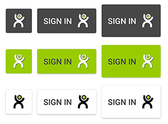

# xee-sdk-android

[](https://travis-ci.org/xee-lab/xee-sdk-android)
[](https://github.com/xee-lab/xee-sdk-android/releases/tag/3.2.0)
[](./LICENSE)

## Purpose

This SDK make easier the usage of [Xee API](https://dev.xee.com/) on [Android devices](https://developer.android.com) !

## Requirements

This SDK works for all devices with an Android version >= [14](https://developer.android.com/reference/android/os/Build.VERSION_CODES.html#ICE_CREAM_SANDWICH)

## Installation

Our SDK is built over [jitpack.io](https://jitpack.io).

In order to use this SDK, please do the following:

Add this to your **root project** `build.gradle`

```groovy
repositories {
    jcenter()
    maven {
    	url "https://jitpack.io"
    }
}
```

Then just add it to the dependencies in the `build.gradle`  **module** wherever you need the SDK API.

```groovy
dependencies {
    compile 'com.github.xee-lab.xee-sdk-android:sdk-core:3.2.0'
    compile 'com.github.xee-lab.xee-sdk-android:sdk-api:3.2.0'
}
```

## Setup

Once the SDK is *installed*, create an *application* on our developer space to get credentials, see [how to create an app](https://github.com/xee-lab/xee-api-docs/tree/master/setup)

Then initialize the SDK following these steps:

1. Create a `XeeEnv` with your credentials information

	```java
	XeeEnv xeeEnv = new XeeEnv(context, new OAuth2Client(clientId, clientSecret, redirectUri), 60, 60, environment);
	```
	
	The environment can be : 
	
	- `XeeEnv.CLOUD` : **production** environment (real client data, Authorization needed)
	- `XeeEnv.SANDBOX` : **sandbox** environment (fake data, no Authorization needed)

2. Use this `XeeEnv` to create an instance of API

	```java
	Xee xeeApi = new Xee(xeeEnv);
	```

Here you have the SDK ready to be used.

## Usage

Here are some examples of commons methods you might use.

> Note that we'll keep this **SDK up to date** to provide you **all the endpoints** availables on the [3rd version of the API](https://github.com/xee-lab/xee-api-docs/tree/master/api/api/v3)

### Init the SDK / Authenticate the user

> Be aware to run this in an UI context ! As it might show a login screen.

```java
xeeApi.connect(new ConnectionCallback(){

    public  void onSuccess(){
        // once here, the SDK is initialized and ready to be used
    }

    public void onError(Throwable error){
        // something went wrong during the authentication.
    }
});
```

### Use the API

All methods return a `XeeRequest` which allows you to do synchronous or asynchronous requests.

The *synchronous* way works like this:

```java
// Do the request
XeeRequest<T> fooRequest = xeeApi.fooMethod();
XeeRequest<T>.Response fooResponse = fooRequest.execute();

// Handle possible error
if(fooResponse.error != null){
    // Handle the error
}

T item = fooResponse.item;
```

The *asynchronous* way works like this:

```java
// Do the request
XeeRequest<T> fooRequest = xeeApi.fooMethod();
fooRequest.enqueue(new XeeRequest.Callback<T>(){
    public void onSuccess(T response){
        // Item response
    }

    public void onError(Error error){
        // Handle the error
    }
});

```

#### Get user information

```java
xeeApi.getUser()
   .enqueue(new XeeRequest.Callback<User>() {
       @Override
       public void onSuccess(User response) {
           // Item response
       }

       @Override
       public void onError(Error error) {
           // Handle the error
       }
   });
```

#### Get the cars of the user

```java
xeeApi.getCars()
   .enqueue(new XeeRequest.Callback<List<Car>>() {
       @Override
       public void onSuccess(List<Car> response) {
           // Item response
       }

       @Override
       public void onError(Error error) {
           // Handle the error
       }
   });
```

#### Get the trips of the car

```java
xeeApi.getTrips(carId, beginDate, endDate)
   .enqueue(new XeeRequest.Callback<List<Trip>>() {
       @Override
       public void onSuccess(List<Trip> response) {
           // Item response
       }

       @Override
       public void onError(Error error) {
           // Handle the error
       }
   });
```

## Parcelable entity

All entities from the SDK implement the `Parcelable` interface, making easier the way to pass data between your components

## Sign-In button

Use the Sign-In button to sign in with Xee. Three themes and three sizes are provided 

- **size:** mini, normal, large
- **theme:** grey, green, white




Use the Sign-In button in layout file

```xml
<com.xee.auth.SignInButton
    android:id="@+id/sign_in_button"
    android:layout_width="wrap_content"
    android:layout_height="wrap_content"
    app:signInBtnSize="normal"
    app:signInBtnTheme="grey"
    />
```

You need to set a callback for result when clicking on the button by using the `setOnSignInClickResult` method and pass the `Xee API` instance that you have set (see [Setup](#setup) step)

Either you implement the `ConnectionCallback` interface and override the `OnError` and `OnSuccess` methods to handle result in the activity

```java
public class MainActivity extends AppCompatActivity implements ConnectionCallback {
	@Override
    public void onError(@NonNull Throwable error) {
        // sign in failed
    }

    @Override
    public void onSuccess() {
        // sign in success
    }
}
```

and pass it in the method

```java
signInButton.setOnSignInClickResult(xeeApi, this);
```

Or you can simply pass an anonymous implementation of `ConnectionCallback` in the method

```java
signInButton.setOnSignInClickResult(xeeApi, new ConnectionCallback() {
    @Override
    public void onError(@NonNull Throwable error) {
        // sign in failed
    }

    @Override
    public void onSuccess() {
        // sign in success
    }
});
```

## Example

We provide a [demo app](app) that shows how the SDK might be used

## Issues

We're working hard to provide you an *issue free SDK*, but we're just humans so [we can do mistakes](http://i.giphy.com/RFDXes97gboYg.gif).

If you find something, feel free to [fill an issue](https://github.com/xee-lab/xee-sdk-android/issues) or/and **fork** the repository to fix it !